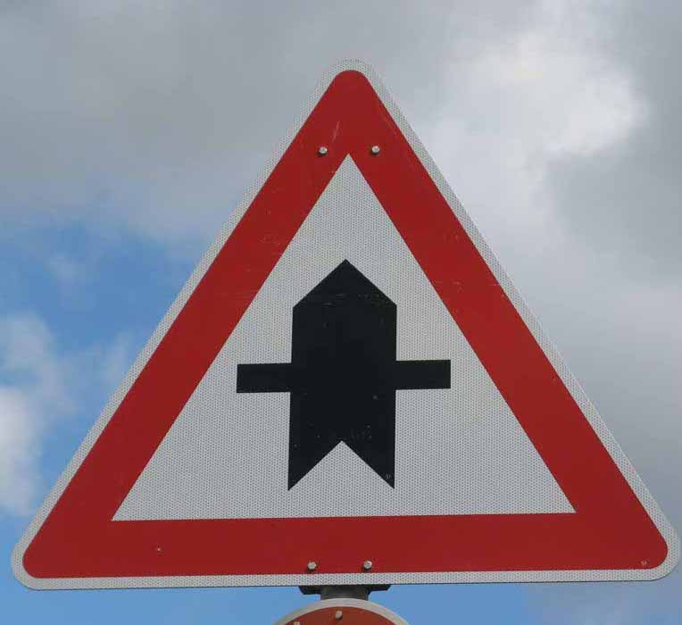
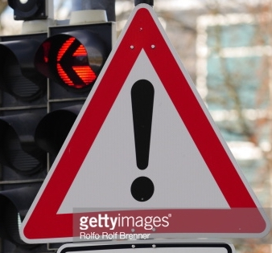
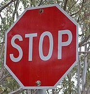
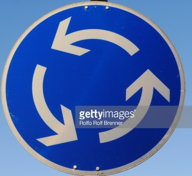

#**Traffic Sign Recognition** 

## Submitted by: Peng Su

---

**Build a Traffic Sign Recognition Project**

The goals / steps of this project are the following:
* Load the data set (see below for links to the project data set)
* Explore, summarize and visualize the data set
* Design, train and test a model architecture
* Use the model to make predictions on new images
* Analyze the softmax probabilities of the new images
* Summarize the results with a written report

[//]: # (Image References)

[image1]: ./report_images/Train_Count_by_Sign.png "Visualization"
[image2]: ./report_images/Show_CLAHE.png "CLAHE"
[image3]: ./report_images/valid_loss.png "valid loss curve"
[image4]: ./web_images/img1.jpg "Traffic Sign 1"
[image5]: ./web_images/img2.jpg "Traffic Sign 2"
[image6]: ./web_images/img3.jpg "Traffic Sign 3"
[image7]: ./web_images/img4.jpg "Traffic Sign 4"
[image8]: ./web_images/img5.jpg "Traffic Sign 5"

## Rubric Points
###Here I will consider the [rubric points](https://review.udacity.com/#!/rubrics/481/view) individually and describe how I addressed each point in my implementation.  

---
###Writeup / README

####1. Provide a Writeup / README that includes all the rubric points and how you addressed each one. You can submit your writeup as markdown or pdf. You can use this template as a guide for writing the report. The submission includes the project code.

You're reading it! and here is a link to my [project code](https://github.com/udacity/CarND-Traffic-Sign-Classifier-Project/blob/master/Traffic_Sign_Classifier.ipynb)

###Data Set Summary & Exploration

####1. Provide a basic summary of the data set. In the code, the analysis should be done using python, numpy and/or pandas methods rather than hardcoding results manually.

I used the pandas library to calculate summary statistics of the traffic
signs data set:

* The size of training set is 34799
* The size of the validation set is 4410
* The size of test set is 12630
* The shape of a traffic sign image is (32,32,3)
* The number of unique classes/labels in the data set is 43

####2. Include an exploratory visualization of the dataset.

Here is an exploratory visualization of the data set. It is a bar chart showing how the train data distributes across the 43 traffic signs. The valid and test have very similar distributions, thus not shown here. 

![alt text][image1]

###Design and Test a Model Architecture

####1. Describe how you preprocessed the image data. What techniques were chosen and why did you choose these techniques? Consider including images showing the output of each preprocessing technique. Pre-processing refers to techniques such as converting to grayscale, normalization, etc. (OPTIONAL: As described in the "Stand Out Suggestions" part of the rubric, if you generated additional data for training, describe why you decided to generate additional data, how you generated the data, and provide example images of the additional data. Then describe the characteristics of the augmented training set like number of images in the set, number of images for each class, etc.)

I tested grayscale, normalization, histogram equalization, and data augmentation. Converting to grayscale does not improve the model's performance. It is suspected that the traffic signs have different colors. For example, alert-related signs such as stop sign have red, and some others are dominated by blue, such as the turning signs. Thus keeping three color channels will provide more information to the classification task. 
For data augmentation, I did rotations and shifts by small random amount. I tested augmenting all the images by 3X, and augmenting only the under-sampled images to the same amount with the max (2010 images in a class). However, neither of the two approaches further improve the model's performance. 
Normailzation and histogram equalization (I used CLAHE: Contrast Limited Adaptive Histogram Equalization) helped a lot. 

Here is an example of a traffic sign image before and after CLAHE.

![alt text][image2]

As a last step, I normalized the image data to be within (-1,1). Note that this is almos necessary for tanh or sigmoid activation fuctions, to avoid vanishing gradients. In this project, I used RELU activation function, which has constant gradients. Thus normalization is not as important as for tanh or sigmoid. But I still noticed prediction accuracy improvements. 

####2. Describe what your final model architecture looks like including model type, layers, layer sizes, connectivity, etc.) Consider including a diagram and/or table describing the final model.
I tested an approach suggested by [published baseline model on this problem](http://yann.lecun.com/exdb/publis/pdf/sermanet-ijcnn-11.pdf), by concatenating the stage 1 convolution output with the stage 2 convolution output as input to the fully-connected layer. However, this approach did not reduce the loss. Thus I used the LeNet architecture from the lecture, and added dropouts to the two convolution layers. 
My final model consisted of the following layers:

| Layer         		|     Description	        					| 
|:---------------------:|:---------------------------------------------:| 
| Input         		| 32x32x3 RGB image   							| 
| Convolution 5x5     	| 1x1 stride, valid padding, outputs 28x28x6 	|
| RELU					|												|
| Max pooling	      	| 2x2 stride,  outputs 14x14x6 				|
| Dropout  |  keep_prob = 0.8 |
| Convolution 5x5	    | 1x1 stride, valid padding, outputs 10x10x16  |
| RELU					|												|
| Max pooling	      	| 2x2 stride,  outputs 5x5x16 				|
| Dropout  |  keep_prob = 0.8 |
| Fully connected		| 400 to 120 									|
| RELU				|        									|
| Fully connected		| 120 to 84 									|
| RELU				|        									|
| Fully connected		| 84 to 43 									|
| Softmax				|        									|
|						|												|
|						|												|
 

####3. Describe how you trained your model. The discussion can include the type of optimizer, the batch size, number of epochs and any hyperparameters such as learning rate.

The hypermeters are shown below:
Optimizer: Adam
Batch size: 128
Num of epoches: 80
Learning rate: 0.001

![alt text][image3]

####4. Describe the approach taken for finding a solution and getting the validation set accuracy to be at least 0.93. Include in the discussion the results on the training, validation and test sets and where in the code these were calculated. Your approach may have been an iterative process, in which case, outline the steps you took to get to the final solution and why you chose those steps. Perhaps your solution involved an already well known implementation or architecture. In this case, discuss why you think the architecture is suitable for the current problem.

Step 1: With grayscale convertion and normalizaton, I tested different dropout keep_probs. As shown the the table below, 0.8 seems to be an optimal value for dropout keep_prob.

Grayscale + Normalize + Dropout

|Dropout Keep_Prob| Train_Loss|Train_Acc|Valid_Loss|Valid_Acc|Test_Loss|Test_Acc|
|:---------------:|:---------:| :------:| :------:| :-----:| :-----:| :-----:| 
| 0.5    | 0.140 | 0.979 | 0.356 | 0.923 | 0.363 | 0.912 |
| 0.65   | 0.049 | 0.991 | 0.282 | 0.942 | 0.324 | 0.929 |
| 0.8    | 0.015 | 0.997 | 0.308 | 0.950 | 0.315 | 0.937 |
| 0.9    | 0.009 | 0.998 | 0.284 | 0.931 | 0.403 | 0.928 |

Step 2: I tested concatenating stage1 and stage2 outputs into fully-connected layer. Comparing the table below with the one above, we can see doing this does not improve performance.

Grayscale + Normalize + Dropout (0.8) + TwoStageConcat

| Train_Loss|Train_Acc|Valid_Loss|Valid_Acc|Test_Loss|Test_Acc|
|:---------:| :------:| :------:| :-----:| :-----:| :-----:| 
| 0.01 | 0.998 | 0.341 | 0.921 | 0.519 | 0.920 |

Step 3: Instead of grayscaling, I tested histogram equalization which increases image contrastness. As shown below, doing this can improve the model. 

Hist + Normalize + Dropout (0.8)

| Train_Loss|Train_Acc|Valid_Loss|Valid_Acc|Test_Loss|Test_Acc|
|:---------:| :------:| :------:| :-----:| :-----:| :-----:| 
| 0.003 | 0.999 | 0.204 | 0.964 | 0.189 | 0.955 |

Step 4: I tested data augmentation by expanding the training data to be 4X big. In each of the 3 expanded images, one image is shifted and rotated by small random amounts. As shown below, it does not boost the model performance.

Hist + Normalize + Dropout (0.8) + Augmentation (x4)

| Train_Loss|Train_Acc|Valid_Loss|Valid_Acc|Test_Loss|Test_Acc|
|:---------:| :------:| :------:| :-----:| :-----:| :-----:| 
| 0.001 | 1.000 | 0.153 | 0.964 | 0.222 | 0.955 |

My final model results (using Step 3 model) were:
* training set accuracy of 1.000
* validation set accuracy of 0.965
* test set accuracy of 0.958

The LeNet has been applied on this dataset with satisfactory results. I modifed the architecture a little bit by reducing the number of filters and fully-connected nodes, and could not find any significant improvement (> 0.5%). With normalization,dropout and histogram equalization, I achieved 95.8% test accuracy. The final accuracy results show that my model works reasonably well. Note that loss results show some overfitting problems, as the training loss is 0.001, validation loss is 0.153, and test loss is 0.222. This is not a severe problem, as long as the accuracy prediction is good. 
 

###Test a Model on New Images

####1. Choose five German traffic signs found on the web and provide them in the report. For each image, discuss what quality or qualities might be difficult to classify.

Here are five German traffic signs that I found on the web:

![alt text][image4] ![alt text][image5] ![alt text][image6] 
![alt text][image7] ![alt text][image8]

####2. Discuss the model's predictions on these new traffic signs and compare the results to predicting on the test set. At a minimum, discuss what the predictions were, the accuracy on these new predictions, and compare the accuracy to the accuracy on the test set (OPTIONAL: Discuss the results in more detail as described in the "Stand Out Suggestions" part of the rubric).

Here are the results of the prediction:

| Image			        |     Prediction	        					| 
|:---------------------:|:---------------------------------------------:| 
| Stop Sign      		| Stop sign   									| 
| General caution 			| General caution 										|
| Road work					| Road work											|
| Right-of-way at the next intersection	      		| Right-of-way at the next intersection					 				|
| Roundabout mandator			| Roundabout mandator      							|

The model was able to correctly guess 5 of the 5 traffic signs, which gives an accuracy of 100%. 

####3. Describe how certain the model is when predicting on each of the five new images by looking at the softmax probabilities for each prediction. Provide the top 5 softmax probabilities for each image along with the sign type of each probability. (OPTIONAL: as described in the "Stand Out Suggestions" part of the rubric, visualizations can also be provided such as bar charts)

The highest probabilities of the five images are: 0.99, 1.00, 1.00, 1.00, and 1.00. Thus the model is pretty sure about all the five images' classes. 

### (Optional) Visualizing the Neural Network (See Step 4 of the Ipython notebook for more details)
####1. Discuss the visual output of your trained network's feature maps. What characteristics did the neural network use to make classifications?

